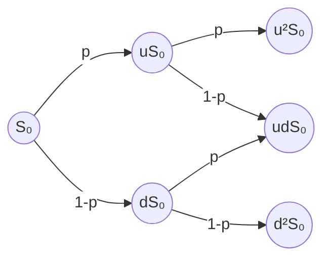

# Implied Volatility Engine and End-to-End Database

## Motivation
Options contracts are financial instruments that give the owner the ability to buy or sell a security in the future, at a specific price and date. Since options contracts relate to future price movement, their price contains information about the market's expectation of the underlying asset's future price trajectory. Through the optimization of mathematical models, this information can be estimated. In particular, this project focuses on quantifying the implied volatility of options contracts for stocks in the S&P 500. 

## Features
You can enter in a ticker for S&P 500 stocks and generate an implied volatility surface for call or put options for end-of-day data. The database updates nightly, pulling the data from various APIs and calculating the implied volatility surfaces with the Black-Scholes, Binomial Tree, and Vellekoop Dividend models. For a given ticker, you can  scroll through the dates, to see how the options surfaces are changing for a single ticker over timer.

  

<h6 align="center">Implied Volatility Engine UI</h6>

## What is Implied Volatility?
In the early 1970s, Black, Scholes and Merton developed a mathematical theory for pricing European options. The Black-Scholes equation is a partial differential equation that describes the price dynamics of an options contract over time. The equation is given by

$$\frac{\partial V}{\partial t} + \frac{1}{2}\sigma^2 S^2 \frac{\partial^2 V}{\partial S^2} + rS \frac{\partial V}{\partial S} - rV = 0$$

where $V$, $t$, $\sigma$, $S$, and $r$ are the option price, time, volatility, stock price and risk-free interest rate, respectively. Black, Scholes and Merton found that solving this partial differential equation for price $V$ gives analytical solutions for the price $V$ of Call and Put options. The Black-Scholes pricing equations for Calls and Puts are 

$$
\text{Call} = S e^{-q T} N(d_1) - K e^{-r T} N(d_2) \text{      and     } \text{Put} = K e^{-r T} N(-d_2) - S e^{-q T} N(-d_1)
$$
where $d_1$ and $d_2$ are given by:
$$
d_1 = \frac{\ln\left(\frac{S}{K}\right) + \left(r - q + \frac{\sigma^2}{2}\right) T}{\sigma \sqrt{T}}
$$
and
$$
d_2 = d_1 - \sigma \sqrt{T}
$$

respectively. 

In other words, the Black-Scholes equations tell us that call and put options are a function of the underlying asset's volatility $\sigma$, which is a measure of  price swing magnitude. 

Since options contracts are forward looking, market prices of Call and Put options contracts contain information about the market's expectation of future price swings in the underlying asset. Moreover, options contracts pertain to a specific expiration date and strike. By solving for implied volatility for each combination of $(date, strike)$, we end up with a surface that describes the market's expectation for the underlying asset's trajectory.

In some sense, implied volatility tells you how expensive an options contract is. In practical terms, it tells you how much someone is willing to pay to hedge the underlying asset.

## A Few Definitions
A **European Option** is an options contract that can only be exercised at expiration. The Black-Scholes equations give an analytical solution for European Options contracts. 

An **American Option** is an options contract that can be exercised before the contract expiration. American Options carry an "**early exercise premium**", which is the extra amount investors are willing to pay for the ability to exercise the options contract before expiration. The ability to exercise the contract early complicates the mathematics and results in a lack of closed form analytical solutions for the pricing of American Options.

For a **put option**, the contract pays a value of $max(K-S_{D},0)$, at the time of exercise, where $K$ is the option **strike price**, $S_{D}$ is the **spot price** of the underlying asset at **time** $D$. 

For a **call option**, the contract pays a value of $max(S_{D}-K,0)$, at the time of exercise, where $K$ is the option **strike price**, $S_{D}$ is the **spot price** of the underlying asset at **time** $D$. 

## Black-Scholes European Pricer

For European Options, the most straightforward way to solve for implied volatility is to use first derivative optimization methods to fit the Black-Scholes equation implied volatility to market data.

This is done by using the first derivative $V = \frac{\partial C}{\partial \sigma}$ of option price $C$ with respect to volatility $\sigma$, which can be derived analytically. This value is referred to as "**Vega** and is given by the equation below: 

$$
V = S \cdot e^{-q \cdot t}\cdot\frac{1}{\sqrt{2\pi}}\cdot e^{-d_1^2/2}\\sqrt{t}
$$

where $S$ is the stock price, $q$ is the continuous dividend yield, $t$ is the time to expiration, and $d_{1}$ is defined in the introductory section.

In this project, I used the Newton-Raphson method, which is an iterative first derivative optimization method to solve equations of a single variable. The Newton-Raphson method solves $\sigma$ by iterating 

$$
\sigma_{n+1} = \sigma_{n} - \frac{BS(\sigma_{n}) - C_{Market}}{V(\sigma_{n})}
$$

until a local minimum is reached , where $BS(\sigma_{n})$ is the Black-Scholes estimation of the option price, $C_{Market}$ is the option market price and $V(\sigma_{n})$ is the point value of Vega for $\sigma_{n}$. For $\sigma_{1}$, I used a hard-coded value between 0 and 1.

  

<h6 align="center">MU Surface Put Option 9-16-2026: Black-Scholes Showing Exaggerated Call Skew</h6>

For American options, this method is an imperfect approximation for close-to-the-money options, but comes up short on out-of-the money options and options with dividends. As this model is derived from the Black-Scholes Equations, which deals specifically with European Options, it does not account for the early exercise premium associated with American Options, resulting in a upwards bias in the implied volatility surface.

## American Binomial Tree Solver 
Because American Options cannot be solved analytically, numerical approximation techniques are used to calculate the value of an American Option. The canonical technique is the Cox-Ross-Rubinstein tree or CRR tree, which uses a binomial tree to calculate the price of call and put options contracts. 

The CRR tree builds out a recombining lattice structure of possible future price points, indexed by time from date of price to contract expiration date. The paths through the lattice structure represent possible price trajectories of the stock's movement across time. It is assumed that the stock price can move in increments $u, d$, which are given by the formulas

$$
u = e^{\sigma \sqrt{\Delta t}} , d = e^{-\sigma \sqrt{\Delta t}}
$$

where $\sigma$ is the implied volatility, $\Delta t$ is the time difference.

The nodes in the lattice are connected by the probabilities $p$, $1-p$ of the stock moving up or down, respectively. Since the contract pays $max(K-S,0)$ for put options and $max(S-K,0)$ for call options, respectively, and since the final nodes of the tree (indexed for time = expiration) contain the contract payout values per possible stock price at expiration, valuing the option contract is simply a matter of backpropagating the expected value, via probabilities $p$, $1-p$, and time value of money, at expiration time to the original node.

Above is a diagram showing the first two timesteps of the lattice. However, the lattice is built with this recombining structure for a greater number of layers, typically between 100 to 1000, with greater accuracy for a higher number of time steps.

The probability $p$ is given by the formula

$$
p = \frac{e^{r \Delta t}-d}{u-d}
$$

where $r$ is the risk free interest rate. Moreover, the expected value at each node is calculated by the formula

$$
C_{(t-\Delta t,i)} = e^{-r\Delta t}(pC_{(t,i+1)} + (1-p)C_{(t,i)})
$$

where $e^{-r \Delta t}$ is the term responsible for discounting expected value by the risk-free interest rate $r$. Since the owner of the option has the possibility of exercising the option early, the expected value of each node needs to be adjusted for that possibility during backpropagation. 

To make this adjustment, we assign an expected value of $max(C_{(t,i)},max(S_{(t,i)} - K)$ for a call option and $max(C_{(t,i)},max(K - S_{(t,i)})$ for a put option, where $S_{(t,i)}$ is the value of the stock price at that particular node in the lattice. Intuitively, this term is saying that the owner of the contract would exercise his options contract before expiration, if the immediate payout is greater than the expected payout.

Building this entire lattice structure, we can price American Options contracts for call and put contracts in this way, using backpropagation and discounting all possible payouts to the present expected value of the starting node.

However, please recall that we are after the implied volatility of an American options contract. So, one thing to keep in mind: At the time the lattice is constructed, a value of $\sigma$ is chosen as part of the process of constructing the lattice. Changing $\sigma$ changes the entire lattice that is built, as $\sigma$ defines the amount gain each price jump has per time interval. In order to calculate $\sigma$ using these binomial trees, we treat the process of building and mapping a price to an options contract as a function of $\sigma$. 

So, given a value of $\sigma$, we obtain a value $P(\sigma)$ through the following steps:

1. Build a lattice structure based on $\sigma$
2. Using the backpropagation technique described above, determine the value of the options contract $P(\sigma)$ according to our choice of $\sigma$.

In this way, we get a function 

$$
\sigma \rightarrow P(\sigma)
$$

that maps $\sigma$ to the value of an option.

By building and solving these trees extremely quickly, we are able to optimize this function and solve for $\sigma$ and that gives us the implied volatility of an American option. 

  

<h6 align="center">MU Surface Put Option 9-16-2026: Binomial Tree</h6>

## Vellekoop Dividend Correction
Another factor that affects the pricing of options contracts are dividend distributions. Dividend distributions greatly complicate the valuation of options contracts and can create scenarios which change the optimal time to execute a contract, and therefore, change the correct valuation of that options contract. As a result, deriving the implied volatility from an options contract is also complicated. 

Theoretically, the effect of dividends on options valuations can be modeled by modifying the CRR tree. For nodes where time > ex-dividend date (the that the upcoming dividend distribution is legally owned) , modifying the CRR tree by subtracting the dividend distributions and adjusting for time value of money gives a conceptually sound model for the valuation of an options contract. However, this breaks the recombining structure of the tree and makes it computationally inefficient to value options contracts. 

  
   
  <em>Non-Recombining Tree: Nardon, Pianca</em>

However, Vellekoop and Nieuwenhuis developed a logically consistent CRR styled tree that uses an interpolation based method to maintain the recombining structure of the tree, while accounting for the effects of dividend distributions. In the Vellekoop, Nieuwenhuis methodology, the lattice structure itself is not changed at all. All dividend correction is handled in the backpropagation phase, during the valuation of each node. To calculate node value, there are two cases.

**Case 1:** The node's time index does not correspond to the ex-dividend date of a distribution. In this case, the node is valued using the standard CRR formula

$$
C_{(t,i)} = e^{-r\Delta t}(pC_{(t+1,i+1)} + (1-p)C_{(t+1,i)}))
$$

**Case 2:** The node's time index corresponds to the ex-dividend date of a distribution. In this case, we refer to the node value produced by interpolation as $C^{Int}_{(i,j)}$ and it is given by the formula

$$
C^{Int}_{(i,j)} = C_{(i,m)} + (C_{(i,m+1)} - C_{(i,m)})\cdot \frac{S_{(i,j)} - Div_{i}}{S_{(i,m+1)} - S_{(i,m)}}
$$

where  $m$ is such that $S_{(i,m)} \leq (S_{(i,j)} - Div_{i}) \leq S_{(i,m+1)}, S_{(i,j)}$ refers to the stock price of node $(i,j)$, $Div_{i}$ refers to the raw dividend distribution value at the ex-dividend date. In other words: If $(i,j)$ is the node that we would like to price, we find the value of $m$ where the equation $S_{(i,m)} \leq (S_{(i,j)} - Div_{i}) \leq S_{(i,m+1)}$ holds true. Please keep in mind that there is an edge case where $m$ does not satisfy that equation. For this edge case, given a fixed $(i,j)$, if $S_{(i,j)} - Div_{i} < S_{(i,m)}$ for all $m$, then no value of $m$ satisfies the equation. In this case, we set $S_{(i,m)} = 0$ and $S_{(i,m+1)} = S_{(i,0)}$ in the equation valuing $`C^{Int}_{(i,j)}`$. The values $C_{(i,m)},C_{(i,m+1)}$ are the valuation values at the ex-dividend time $i$ pre-interpolation. That is, the values that are obtained from the valuation equation in Case 1. 

So, to summarize: For a fixed node $(i,j)$, we calculate the valuation $`C^{Int}_{(i,j)}`$ by first identifying the value $m$ satisfying equation $S_{(i,m)} \leq (S_{(i,j)} - Div_{i}) \leq S_{(i,m+1)}$ or replacing $S_{(i,m)} , S_{(i,m+1)}$  with the values $0, S_{(i,0)}$ in the valuation equation when $S_{(i,j)} - Div_{i} < S_{(i,m)}$. Then, the interpolation value $`C^{Int}_{(i,j)}`$ is calculated using the uninterpolated values $C_{(i,m)}, C_{(i,m+1)}$, which are obtained using the formula in Case 1, and we simply apply those values to the evaluation equation written in Case 2. 

Calculating valuations in this way, we are able to adjust for dividends. 

*Vellekoop Dividend Adjustment CVX*

However, implied volatility surfaces are forward looking. As a result, ex-dividend dates, expected dividend values are not available for the entire options chain. In this algorithm, I used future dividend data when it existed. For future dividends that have not been announced yet, I used the most recently announced dividend value for the rest of the options chain, assuming ex-dividend dates on a periodic 91 day schedule. 

I did not make any special adjustments for stocks with irregular dividends, such as special dividends or dividends that are dispersed on a non-quarterly schedule (i.e., 2 times a year, 3 times a year). As a result, this dividend adjustment is not adapted for the small fraction of S&P 500 stocks in this category.

## Architecture and Data Sources
To get the options, stock and dividend data, I scraped a variety of free APIs and websites. I've included a list of the architecture and data sources that I used below. 

- **Database:** PostgreSQL
- **UI:** Streamlit & Plotly
- **Dividend Data:** Massive API
- **Stock & Options Chain Data:** ThetaData API
- **Computations:** Numba
- **Interest Rate Data:** Federal Reserve Bank of New York's Website
- **S&P 500 Ticker Changes:** Wikipedia

  
   
  <em>Architecture Overview</em>

  
   
  <em>PostgreSQL Database</em>

## Limitations, Challenges and Future Interest
There are several major limitations and potential areas for improvement with this project. The main limitation of this project is it's inability to fully capture the implied volatility curve of deep out-of-the-money and deep in-the-money options contracts. These contracts are difficult to solve because of limited liquidity. To deal with this problem, modern industry engines (such as Vola Dynamics) solve volatility curves parametrically, fitting one single curve across an entire range of strike prices per expiration date. This allows for pricing of the entire curve, globally, better capturing the shape and skew of the curve.

On the other hand, solving entire CRR trees is computationally intensive and cannot be done quickly. To the best of my knowledge, modern systems use a technique called "Deamericanization", where an American Option is transformed into a European Option and the options contract is solved parametrically using a Black-Scholes solver. This allows for faster processing of Implied Volatility surfaces, which are typically processed in real-time. 

The second major area for improvement is with quality assurance. I do not yet have access to a professional grade dataset for testing my surfaces against.

Other areas for improvement include removing arbitrage/no arbitrage on the surface, adjusting for stock splits, and future dividend growth rates for dividend adjustments.

## References

- Marasović, B., Aljinović, Z., & Poklepović, T. (2011). Numerical methods versus Bjerksund and Stensland approximations for American options pricing. International Journal of Social, Behavioral, Educational, Economic, Business and Industrial Engineering, 5(10), 1318–1325.
- Vellekoop, M. H., & Nieuwenhuis, J. W. (2006). Efficient pricing of derivatives on assets with discrete dividends. Applied Mathematical Finance, 13(3), 265–284. doi.org
- Black, F., & Scholes, M. (1973). The pricing of options and corporate liabilities. Journal of Political Economy, 81(3), 637–654. https://doi.org/10.1086/260062
- Cox, J. C., Ross, S. A., & Rubinstein, M. (1979). Option pricing: A simplified approach. Journal of Financial Economics, 7(3), 229–263. doi.org
- Nardon, M., & Pianca, P. (2008). An efficient binomial approach to the pricing of options on stocks with cash dividends (Working Paper No. 178). Department of Applied Mathematics, Università Ca' Foscari Venezia. https://ideas.repec.org/p/vnm/wpaper/178.html
